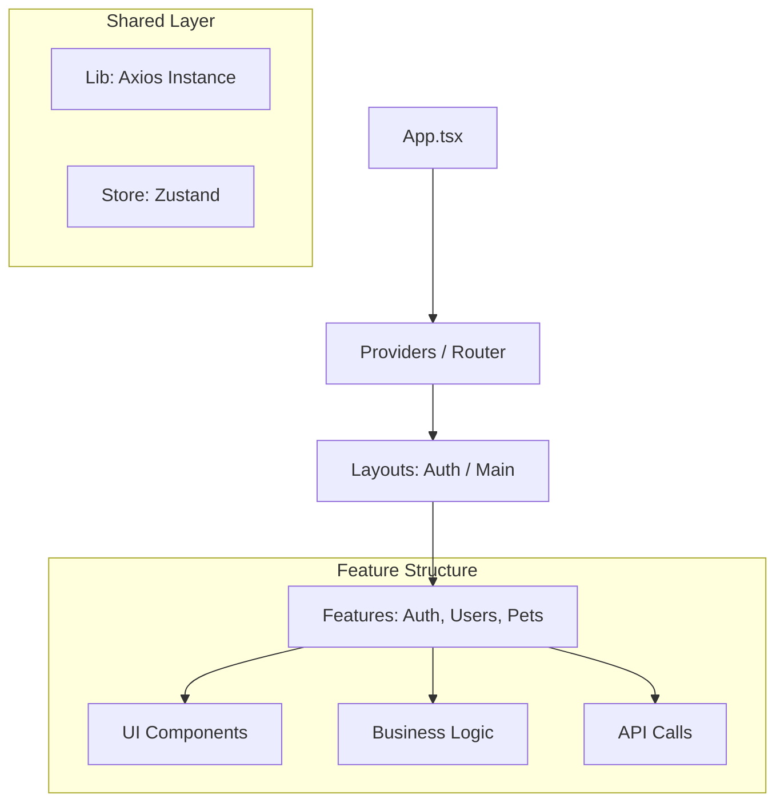

# 🐾 Pet Shop Ecosystem - Frontend

---


Este é o Client Application do ecossistema Pet Shop. Uma interface moderna, performática e extremamente segura, construída para consumir microsserviços utilizando os padrões mais rigorosos do mercado, como OAuth2 com PKCE.

- Segurança (OAuth2 + PKCE)
- Escalabilidade (Feature-based Architecture)
- Resiliência de rede (Token refresh sem race condition)
- Boa DX (TypeScript, Vite, UI moderna)

Ideal para sistemas corporativos, ERPs e microsserviços.

---
## 🏗️ Arquitetura de Software

O projeto utiliza uma Feature-based Architecture (Vertical Slices). Em vez de organizar por "tipo de arquivo" (ex: todos os controllers juntos), organizamos por funcionalidade de negócio.

## 🔐 Segurança & Resiliência de Rede
**Diferente de SPAs comuns, este projeto implementa:**

* Flow OAuth2 + PKCE (Proof Key for Code Exchange): Garante que o authorization_code só possa ser trocado por tokens pelo cliente que o solicitou.

* Singleton Promise Token Refresh: Se 10 requisições falharem simultaneamente com 401 (Token Expirado), apenas uma chamada de refresh é feita. As outras 9 ficam na FailedQueue e são re-executadas automaticamente assim que o novo token chega.

* Recuperação de Senha Segura: Tokens de redefinição com tempo de expiração curto e invalidação automática após uso, prevenindo ataques de replay.

* Silent Refresh: Hook dedicado para manutenção de sessão em background.
---

## 🛠️ Tech Stack
* Core: React 18 + Vite (SWC) + TypeScript.

* UI/UX: Tailwind CSS + Shadcn/ui (Radix UI) + Lucide Icons + Sonner (Toasts).

* State Management:
  * Zustand: Estado global leve e persistente.

  * React Query: Planejado para gerenciamento de cache de servidor.

* Forms: React Hook Form + Zod (Validação Schema-based).

* Networking: Axios com interceptors customizados.

* Autenticação: OAuth2 com PKCE (Authorization Code Flow).
---

## 📂 Estrutura do Projeto
O projeto segue uma arquitetura baseada em Features (módulos de negócio), facilitando a manutenção e o desacoplamento de código.
```
src/
├── assets/          # Assets estáticos (Logos, imagens)
├── components/      # UI Kit (Shadcn) e componentes globais reutilizáveis
├── config/          # Variáveis de ambiente e constantes globais (env.ts)
├── features/        # Módulos de negócio (Vertical Slices)
│   ├── auth/        # Lógica de autenticação, hooks e views
│   ├── users/       # Gerenciamento de usuários
│   └── sales/       # Módulos futuros (ex: Vendas)
├── layouts/         # Estruturas de página (Sidebar, Navbar, AuthLayout)
├── lib/             # Configurações de bibliotecas (Axios instance, Utils)
├── pages/           # Entry points das rotas (Lazy loading)
├── store/           # Stores globais do Zustand
└── App.tsx          # Definição de rotas e Providers
```

### Princípios da Arquitetura

- Cada feature é autocontida (hooks, services, views, types)
- Nada fora da feature importa arquivos internos dela
- Comunicação entre features ocorre apenas via camadas compartilhadas (lib, store)

---
## 🚀 Como Iniciar
**Pré-requisitos**
* `Node.js 18+` e `NPM/PNPM/Yarn.`

**Instalação**
1. Clone o projeto: 
```bash
git clone https://github.com/iXDGabrielTK/petshop-frontend.git
cd petshop-frontend
```

2. Instale as dependências:
```bash
npm install
```

3. Configure as variáveis de ambiente:
   * Crie um arquivo `.env` na raiz do projeto baseado no `.env` abaixo e preencha com suas credenciais OAuth2 e URLs de API.
```bash
VITE_API_URL=http://localhost:8080
VITE_AUTH_CLIENT_ID=petshop-client
VITE_AUTH_URL=http://localhost:8081/oauth2/authorize
VITE_TOKEN_URL=http://localhost:8081/oauth2/token
VITE_REDIRECT_URI=http://127.0.0.1:3000/authorized
```

4. Inicie o servidor de desenvolvimento:
```bash
npm run dev
```
---
 
### Fluxo de Autenticação (Resumo)
```
1. Usuário acessa rota protegida
2. Redirecionamento para o provedor OAuth2 (PKCE)
3. Retorno com authorization code
4. Troca de código por tokens (access + refresh) via backend OAuth
5. Tokens armazenados com persistência segura
6. Axios interceptors mantêm a sessão automaticamente
```
---

## **🔮 Roadmap & Futuro**
**O objetivo deste projeto é servir como um cliente robusto para microsserviços/ERPs. As próximas etapas incluem:**

### Status Atual do Projeto

* [x] Autenticação OAuth2 completa  

* [x] Fluxo de Recuperação de Senha (Esqueci a Senha / Redefinir Senha)

* [x] Camada de rede resiliente  

* [x] Arquitetura baseada em Features

* [x] Design system configurado

### 🚧 Em desenvolvimento:

* [ ] Implementação de Dashboards analíticos com Recharts.

* [ ] Integração completa de CRUDs para os módulos de negócio.

* [ ] Testes Unitários e E2E (Vitest/Playwright).

* [ ] CI/CD Pipelines.

---
## 📄 Licença

Este projeto está sob a licença MIT - veja o arquivo [LICENSE](LICENSE) para detalhes.

---

## 📬 Contato
Gostou do projeto ou quer trocar uma ideia técnica? Vamos conversar.

* **LinkedIn:** https://www.linkedin.com/in/gabriel-tanaka-b1669b175/

* **Email:** gabrielferraritanaka@gmail.com